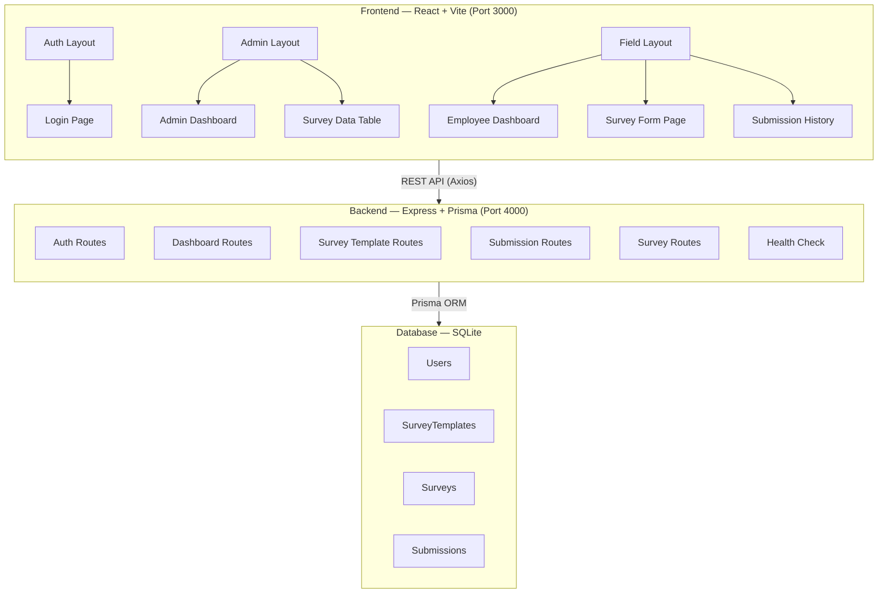
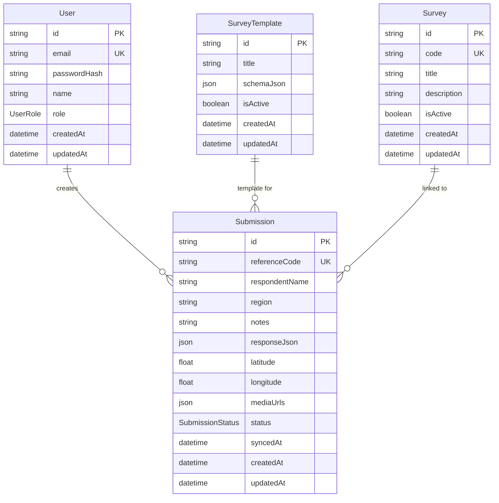
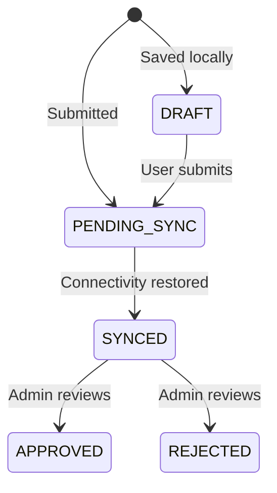

# Field Intelligence — Application Description

> A full-stack **Field Survey Management System** that enables organizations to create survey forms, collect field data (with geolocation & media), track submission lifecycles, and manage operations across two distinct user roles — **Admin** and **Employee (Field Worker)**.

---

## Architecture Overview

---

## Tech Stack

| Layer | Technology |
|-------|-----------|
| **Frontend Framework** | React 19 + TypeScript |
| **Build Tool** | Vite 8 |
| **Styling** | TailwindCSS 3.4 + Custom CSS Design System |
| **State Management** | TanStack React Query 5 |
| **Form Handling** | React Hook Form + Zod validation |
| **HTTP Client** | Axios with interceptors |
| **Routing** | React Router DOM 7 |
| **Backend Framework** | Express 5 |
| **ORM** | Prisma 7.7 (with better-sqlite3 adapter) |
| **Database** | SQLite (dev.db file) |
| **Authentication** | bcryptjs (password hashing) + session headers |
| **File Uploads** | Multer (disk storage) |
| **Security** | Helmet, CORS |
| **Logging** | Morgan (HTTP request logger) |
| **Validation** | Zod (shared across client & server) |

---

## Feature Breakdown

### 1. 🔐 Authentication & Session Management

| Feature | Details |
|---------|---------|
| **Email/Password Login** | Users log in with email and password; credentials are validated against bcrypt-hashed passwords stored in the database |
| **Role-Based Access** | Two roles: `ADMIN` and `EMPLOYEE` — each gets a completely different UI layout and navigation |
| **Session Persistence** | Session stored in `localStorage` under key `fieldproj.session`; user info (id, email, name, role) is persisted across page refreshes |
| **Auto-Redirect** | If a session already exists on the login page, the user is auto-redirected to `/dashboard` |
| **Header-Based Auth** | Every API request includes `x-user-email` and `x-user-role` headers via an Axios interceptor; the server middleware (`attachUser`) resolves the user from the database |
| **Logout** | Clears `localStorage` session and redirects to login |
| **Demo Accounts** | Pre-seeded accounts: `admin@org.org / admin123` (Admin) and `field@org.org / field123` (Employee) |

---

### 2. 🛡️ Role-Based Route Protection

| Feature | Details |
|---------|---------|
| **RoleGate Component** | A wrapper component that checks the user's session and role before rendering child routes |
| **Admin-Only Routes** | `/surveys/data` — only accessible to `ADMIN` users |
| **Employee-Only Routes** | `/surveys/new`, `/surveys/new/:templateId`, `/surveys/history` — only for `EMPLOYEE` users |
| **Shared Routes** | `/dashboard` — accessible to both roles, but renders **different dashboards** depending on the role |
| **Unauthorized Redirect** | Users without the correct role are redirected to `/dashboard`; unauthenticated users are sent to `/login` |

---

### 3. 📊 Admin Dashboard — Form Management Console

The admin dashboard is a full command center with:

| Feature | Details |
|---------|---------|
| **KPI Metrics Grid** | Displays 4 key metrics in a responsive grid: **Total Forms**, **Total Submissions**, **Today's Submissions**, **Pending Sync**, **Active Employees** |
| **Recent Activity Feed** | Shows the 3 most recent submissions with reference code, respondent name, region, status chip, form title, and timestamp |
| **Workspace Snapshot** | A panel showing sync health information and active form counts |
| **Quick Navigation** | "Create New Form" button that smooth-scrolls to the form builder section |
| **Sidebar Navigation** | Fixed sidebar with "Dashboard" and "Survey Data" links; active link is highlighted |

---

### 4. 🏗️ Admin Form Builder (Survey Template Creator)

A dynamic, interactive form builder that lets admins create survey templates:

| Feature | Details |
|---------|---------|
| **Dynamic Question Addition** | Add unlimited questions to a form template dynamically |
| **Question Types** | Three types supported: **Text** (free input), **Dropdown** (select from options), **Radio** (pick one from options) |
| **Per-Question Configuration** | Each question has: Label, Type selector, Options (comma-separated), Required toggle |
| **Question Removal** | Remove individual questions (minimum 1 must remain) |
| **Schema Storage** | Templates are stored as structured JSON (`schemaJson`) containing the full question array |
| **Auto-Publish** | Created forms are immediately set as `isActive: true` and become available to employees |
| **Success Feedback** | Form resets and shows confirmation after successful save |
| **Validation** | Title must not be empty; at least one question required; powered by Zod on both client and server |

---

### 5. 📋 Employee Dashboard — Available Forms

| Feature | Details |
|---------|---------|
| **Form Selector Grid** | Displays all active survey templates as clickable cards in a responsive 3-column grid |
| **Card Details** | Each card shows: form title, question count, and "Open" status chip |
| **Hover Animations** | Cards have lift-on-hover animations for interactivity |
| **Quick Stats** | Bottom section shows: Today's Submissions, Pending Sync, Active Employees as metric cards |
| **Direct Navigation** | Clicking a form card navigates directly to `/surveys/new/:templateId` |

---

### 6. 📝 Survey Submission Form (Field Data Entry)

The core data collection interface for field workers:

| Feature | Details |
|---------|---------|
| **Template-Driven Rendering** | The form dynamically renders questions based on the selected template's `schemaJson` |
| **Field Types** | Supports **text inputs**, **dropdown selects**, and **radio button groups** — all rendered programmatically |
| **Respondent Info** | Captures: Respondent Name, Ward/Region |
| **GPS Geolocation** | Automatically requests browser location permission on page load; captures latitude & longitude with high accuracy; displays status chip ("Locating…", "Location captured", "Location blocked") |
| **Survey Notes** | Multi-line textarea for free-form notes |
| **Camera / File Upload** | File input with `capture="environment"` attribute for mobile camera; accepts images (`image/*`) and PDFs; supports multiple file uploads (up to 6) |
| **Image Preview** | Uploaded images show inline previews with file name and size; PDFs show a placeholder |
| **Auto-Reference Code** | Server generates sequential reference codes (e.g., `SUB-2001`, `SUB-2002`) |
| **Multi-Part Submission** | Sends data as `multipart/form-data` to support file uploads alongside JSON data |
| **Success Confirmation** | Shows reference code and status after submission; form resets for next entry |
| **Error Handling** | Inline error messages for validation failures and API errors |
| **Template Auto-Select** | If no template is specified in the URL, auto-selects the first active template |

---

### 7. 📊 Survey Data Table (Admin View)

An admin-only data table for reviewing all submissions:

| Feature | Details |
|---------|---------|
| **Full Submission Table** | Displays all submissions in a structured table with columns: Submission ID, Respondent, Region, Survey (template title), Status |
| **Status Chips** | Color-coded status badges showing: `DRAFT`, `PENDING SYNC`, `SYNCED`, `APPROVED`, `REJECTED` |
| **Location Pins** | If geolocation was captured, shows coordinates with a **"Open in Google Maps"** link that opens the exact GPS position |
| **Media Attachments** | Displays thumbnail previews for images and download links for other files; shows up to 4 thumbnails in a grid |
| **Download Links** | Every attached file has a direct download link pointing to the server's `/uploads/` directory |
| **Creator Tracking** | Tracks which user created each submission |

---

### 8. 📜 Submission History (Employee View)

An audit trail for field workers to review recent submissions:

| Feature | Details |
|---------|---------|
| **Activity Feed** | Shows the 10 most recent submissions sorted by update time |
| **Entry Details** | Each entry displays: reference code, status chip, descriptive detail string, and formatted timestamp |
| **Audit Trail** | Detail strings include who performed the action (e.g., "SUB-1024 synced by Ravi Mehta") |
| **Timestamps** | Formatted as human-readable short dates (e.g., "Apr 15, 2:30 PM") |

---

### 9. 🗄️ Database Model & Submission Lifecycle

**Submission Status Lifecycle:**

---

### 10. 🔌 REST API Endpoints

| Method | Endpoint | Auth | Role | Description |
|--------|----------|------|------|-------------|
| `POST` | `/api/auth/login` | ❌ | Any | User login with email & password |
| `GET` | `/api/health` | ❌ | Any | Health check (`{ status: "ok" }`) |
| `GET` | `/api/dashboard/summary` | ✅ | Any | Dashboard metrics + recent submissions |
| `GET` | `/api/surveys/templates/active` | ✅ | `EMPLOYEE`, `ADMIN` | List active survey templates |
| `GET` | `/api/surveys/templates/:templateId` | ✅ | Any | Get specific template by ID |
| `POST` | `/api/surveys/templates` | ✅ | `ADMIN` | Create new survey template |
| `GET` | `/api/surveys/active` | ❌ | Any | Get the latest active survey |
| `GET` | `/api/surveys` | ❌ | Any | List all surveys |
| `GET` | `/api/submissions` | ✅ | Any | List all submissions (with template & creator) |
| `POST` | `/api/submissions` | ✅ | Any | Create submission (multipart/form-data, up to 6 files) |
| `GET` | `/api/submissions/history` | ✅ | Any | Recent 10 submissions as audit history |

---

### 11. 📂 File Upload & Media Management

| Feature | Details |
|---------|---------|
| **Storage** | Multer disk storage in `server/uploads/` directory |
| **File Naming** | Timestamp prefix + sanitized original name + original extension (e.g., `1713200000000-photo-001.jpg`) |
| **Supported Types** | Images (`image/*`) and PDFs (`application/pdf`) |
| **Upload Limit** | Maximum 6 files per submission |
| **Static Serving** | Uploaded files are served statically via Express at `/uploads/` path |
| **Mobile Camera** | The `capture="environment"` attribute allows direct camera opening on mobile devices |

---

### 12. 🎨 Design System & UI Components

| Component | Description |
|-----------|-------------|
| **AuthLayout** | Split-screen layout with gradient hero panel (left) and form (right); glassmorphism effects |
| **AdminLayout** | Fixed sidebar navigation + sticky header with logout; responsive with sidebar hidden on mobile |
| **FieldLayout** | Top header bar + fixed bottom tab navigation for mobile (3-column grid nav) |
| **PageShell** | Reusable page wrapper with section label, title, description, and action slot |
| **Button** | Supports `primary` and `secondary` variants; disabled state handling |
| **Card** | Rounded border container with customizable padding and elevation |
| **TextField** | Labeled input with border transitions on focus |
| **StatusChip** | Pill-shaped status badge used for submission status and form counts |

**Design Tokens (CSS Custom Properties):**

| Token | Value | Purpose |
|-------|-------|---------|
| `--color-primary` | `#0040a1` | Primary brand blue |
| `--color-primary-container` | `#0056d2` | Lighter primary variant |
| `--color-surface` | `#f8f9fa` | Main background |
| `--color-on-surface` | `#191c1d` | Primary text on surface |
| `--color-on-surface-variant` | `#424654` | Secondary text |
| `--color-outline-variant` | `#c3c6d6` | Borders and dividers |
| `--color-secondary` | `#48626e` | Accent color |
| `--color-tertiary` | `#822800` | Warm accent (used for destructive actions) |
| `--color-error` | `#ba1a1a` | Error state |
| `--color-error-container` | `#ffdad6` | Error background |

---

### 13. 🛡️ Security Features

| Feature | Details |
|---------|---------|
| **Helmet** | Sets security HTTP headers (CSP, X-Frame-Options, etc.) |
| **CORS** | Enabled via `cors()` middleware for cross-origin requests |
| **Password Hashing** | bcryptjs with 10 salt rounds |
| **Input Validation** | Zod schemas on every endpoint validate request bodies |
| **Error Handling** | Centralized error handler hides internal errors from clients |
| **File Safety** | Upload filenames are sanitized (only `a-zA-Z0-9_-` characters allowed, max 40 chars) |

---

### 14. 🌱 Database Seeding

The application auto-seeds on startup with:

| Seed Data | Details |
|-----------|---------|
| **2 Users** | Admin (`Asha Verma`) and Employee (`Ravi Mehta`) with hashed passwords |
| **1 Survey** | "Household Baseline Survey" with description |
| **1 Survey Template** | "Household Baseline Form" with 4 questions: Household Name (text), Ward/Region (dropdown with 5 options), Visit Type (radio with 3 options), Remarks (text) |
| **3 Submissions** | Sample submissions with different statuses: `SYNCED`, `PENDING_SYNC`, `APPROVED` — complete with respondent names, regions, notes, and response data |

> [!NOTE]
> Seeding uses `upsert` operations, making it safe to run repeatedly without creating duplicates.

---

### 15. 🔄 Real-Time Data Synchronization

| Feature | Details |
|---------|---------|
| **React Query Caching** | All data is fetched via TanStack Query with automatic caching and stale-time management |
| **Mutation Invalidation** | Creating a submission automatically invalidates `submissions`, `submission-history`, and `dashboard-summary` query caches — keeping all views in sync |
| **Template Invalidation** | Creating a new template invalidates `survey-templates` and `dashboard-summary` caches |
| **Optimistic UI** | Loading and error states are handled across all queries with fallback displays |

---

## Page Summary

| Route | Access | Description |
|-------|--------|-------------|
| `/login` | Public | Email/password sign-in with split-screen hero |
| `/dashboard` | Authenticated | Role-adaptive dashboard (Admin: metrics + form builder; Employee: form selector + stats) |
| `/surveys/data` | Admin only | Full submission data table with location pins, media, and statuses |
| `/surveys/new` | Employee only | Dynamic survey form with geolocation and file upload |
| `/surveys/new/:templateId` | Employee only | Pre-selected template variant of the survey form |
| `/surveys/history` | Employee only | Audit trail of recent submissions |
| `*` | Public | 404 Not Found page with return-to-login link |
